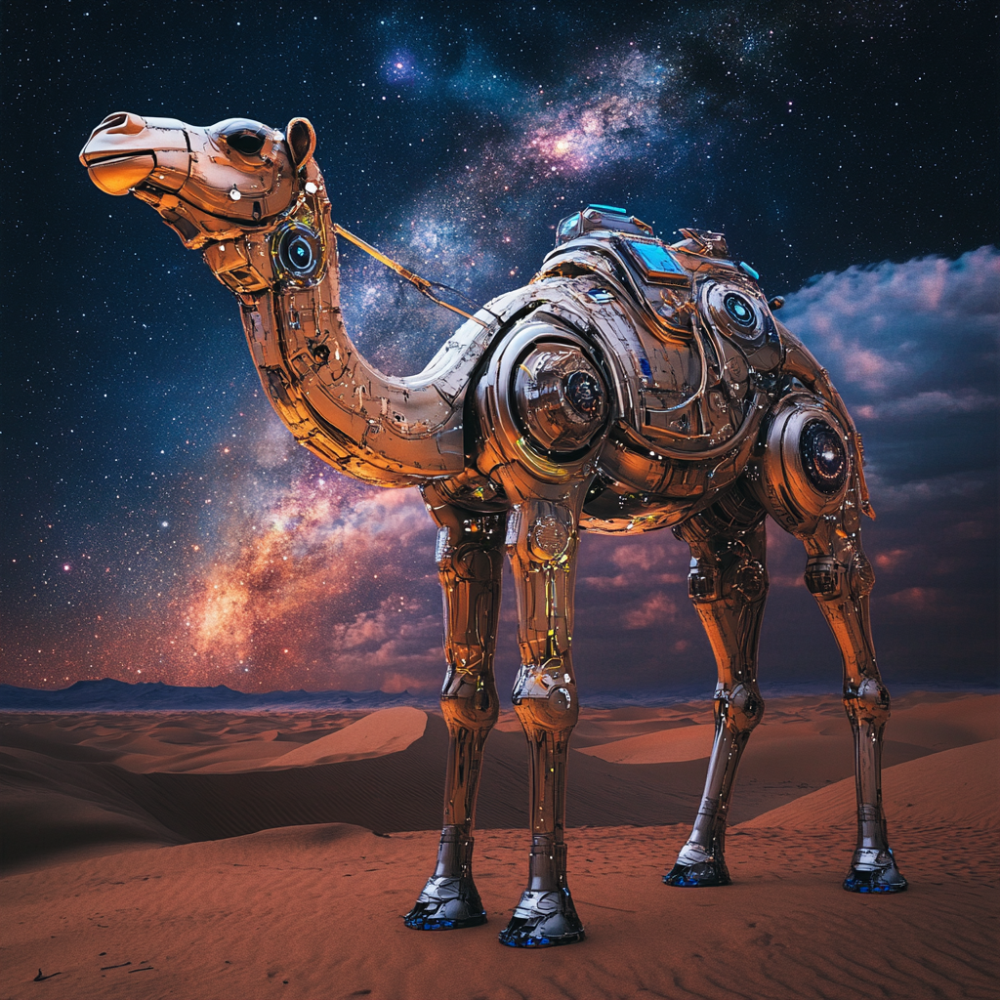

AI agents to help working with CAMELS (Cosmology and Astrophysics with MachinE Learning Simulations) data.

# Installation

### Requirements:
You need python 3.10 or above to install CAMELS_agents properly.

### Instructions:
- git clone https://github.com/franciscovillaescusa/CAMELS_Agents.git
- cd CAMELS_Agents
- python -m venv CA_env
- source CA_env/bin/activate
- pip install .

At this point, the library should be installed together with all its dependencies. Next we need two more ingredients:

1. An environment file. Inside CAMELS_Agent, create a .env file and put this content inside it:
```LANGCHAIN_TRACING_V2=true
LANGCHAIN_API_KEY=
LANGCHAIN_ENDPOINT=https://api.smith.langchain.com
LANGCHAIN_PROJECT=Tools
GROQ_API_KEY=
GOOGLE_API_KEY=
GOOGLE_APPLICATION_CREDENTIALS=gemini.json
SEMANTIC_SCHOLAR_KEY=
```
fill the missing blocks with your API keys.

2. A gemini.json file to use google gemini and embedding model. For this follow these instructions:
	- login into google cloud: https://console.cloud.google.com/
	- create a project
	- go to IAM & Admin
	- go to Service Accounts
	- create Service Account
	- choose a name
	- Create and Continue
	- Grant the "Vertex AI User" role
	- click Continue and then Done
	- click in the three dots and Manage keys
	- Add key --> Create new key --> JSON --> Create
	- Download the JSON file and place it inside the CAMELS_Agent subfolder
	- change the name of that file to gemini.json

Once you have complete the above steps you can run the code with
`streamlit run app.py`

## Team:

- Francisco Villaescusa-Navarro (Flatiron)
- Boris Bolliet (Cambridge)